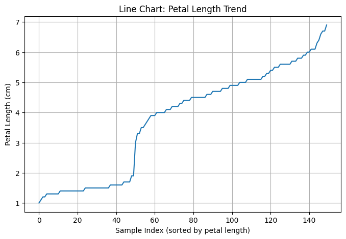
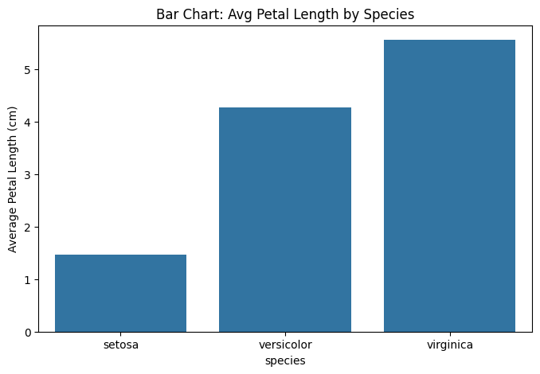
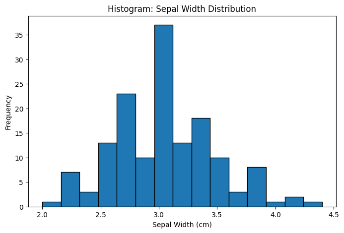
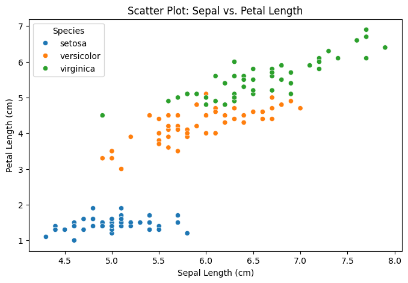

# Iris Data Analysis Project

## Overview
This project performs exploratory data analysis and visualization on the famous Iris dataset using Python's Pandas, Matplotlib, and Seaborn libraries. The Iris dataset is a multivariate dataset introduced by Ronald Fisher in 1936 that has become a standard example for pattern recognition and classification tasks.

## Objectives
1. Load and explore the Iris dataset
2. Perform basic statistical analysis
3. Create informative visualizations
4. Document findings and insights

## Project Structure
```
iris-data-analysis/
├── README.md               # Project documentation
├── iris-data-analysis.ipynb # Jupyter notebook with analysis code
└── plots/                  # Directory containing generated visualizations
    ├── bar_chart.png
    ├── histogram.png
    ├── line_chart.png
    └── scatter_plot.png
```

## Requirements
Install required packages using:
```bash
pip install pandas matplotlib seaborn jupyter
```

## Dataset Description
The Iris dataset contains 150 samples of iris flowers, each with four features:
- Sepal length (cm)
- Sepal width (cm)
- Petal length (cm)
- Petal width (cm)

The samples belong to three iris species:
- Iris setosa
- Iris versicolor
- Iris virginica

## Steps Performed

### Task 1: Load and Explore Dataset
```python
import pandas as pd
import seaborn as sns

try:
    # Load dataset
    iris = sns.load_dataset('iris')
    
    # Display first 5 rows
    print(iris.head())
    
    # Dataset information
    print(iris.info())
    
    # Check for missing values
    print(iris.isnull().sum())
    
    # Clean data if necessary
    iris_clean = iris.dropna()
except Exception as e:
    print(f"Error loading dataset: {e}")
```

### Task 2: Perform Basic Analysis
```python
# Descriptive statistics
print(iris_clean.describe())

# Group by species and compute averages
species_avg = iris_clean.groupby('species').mean()
print(species_avg)
```

### Task 3: Create Visualizations
```python
import matplotlib.pyplot as plt
import os

# Create plots directory if not exists
os.makedirs('plots', exist_ok=True)

# Line chart (sepal length over samples)
plt.figure(figsize=(10, 6))
for species in iris_clean['species'].unique():
    species_data = iris_clean[iris_clean['species'] == species]
    plt.plot(species_data.index, species_data['sepal_length'], label=species)
plt.title('Sepal Length by Sample')
plt.xlabel('Sample Index')
plt.ylabel('Sepal Length (cm)')
plt.legend()
plt.savefig('plots/line_chart.png')
plt.close()

# Bar chart (average petal length by species)
species_avg['petal_length'].plot(kind='bar')
plt.title('Average Petal Length by Species')
plt.ylabel('Petal Length (cm)')
plt.savefig('plots/bar_chart.png')
plt.close()

# Histogram (sepal width distribution)
iris_clean['sepal_width'].hist()
plt.title('Distribution of Sepal Width')
plt.xlabel('Sepal Width (cm)')
plt.ylabel('Frequency')
plt.savefig('plots/histogram.png')
plt.close()

# Scatter plot (sepal length vs sepal width)
sns.scatterplot(
    x='sepal_length', 
    y='sepal_width', 
    hue='species', 
    data=iris_clean
)
plt.title('Sepal Length vs Sepal Width')
plt.savefig('plots/scatter_plot.png')
plt.close()
```

## Visualization Outputs

*Sepal length measurements across samples*


*Average petal length by species*


*Distribution of sepal width measurements*


*Sepal length vs sepal width colored by species*

## Error Handling
The code includes a try-except block when loading the dataset to handle potential errors. Additional error handling could be added for:
- File I/O operations
- Plot generation failures
- Invalid data types

## Findings & Insights
1. **Species Differentiation**: 
   - Setosa has distinctly smaller petals than other species
   - Virginica has the largest sepals on average
   
2. **Correlations**:
   - Strong positive correlation between petal length and petal width
   - Moderate correlation between sepal length and petal length
   
3. **Distributions**:
   - Sepal width shows near-normal distribution
   - Petal measurements show bimodal distribution
   
4. **Classification Potential**:
   - Petal measurements provide better species separation than sepal measurements
   - Linear separability observed between setosa and other species

## How to Run
1. Install required packages:
   ```bash
   pip install -r requirements.txt
   ```
2. Execute the Jupyter notebook:
   ```bash
   jupyter notebook iris-data-analysis.ipynb
   ```
3. Run all cells in the notebook
4. Generated plots will be saved in the `plots/` directory

## Author
[Benjamin Bella]
